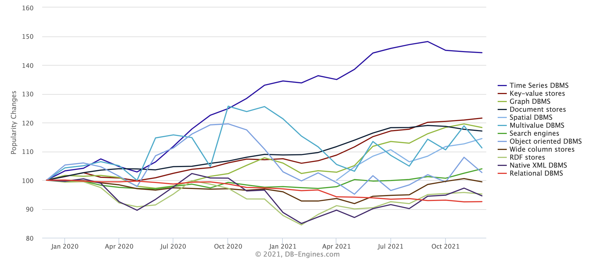

# State of the Art

Dieser Abschnitt widmet sich der Frage, warum TSDB in den letzten Jahren so stark an Popularität gewonnen hat und sich gegenüber anderen Datenbanken immer weiter durchsetzt [2.3.2].

Heutzutage werden Zeitreihendaten in immer größeren Mengen generiert. Quellen aus denen Zeitreihendaten heute erzeugt werden sind z.B. <!--z.B. ausschreiben -->Messungen, die von Sensoren erzeugt werden (z.B. von IoT-Geräten), Erfassung von Trends bei Suchmaschinenanfragen, Statusinformationen und andere Metriken, die von komplexen Systemen zu Überwachungszwecken erzeugt werden, Aktien und Kryptowährungen dessen Preise sich sekündlich ändern, Anrufe, Nachrichten und andere Signale, die von Kommunikationsgeräte oder entsprechenden Anwendungen gesendet werden [2.3.3].  
Um sich ändernde zeitbasierte Daten zu messen und zu analysieren, werden effiziente Methoden zum Speichern und Abrufen von Daten benötigt.
Lange Zeit wurden für derartige Szenarien klassische Datenbanken verwendet. Z.B. <!--z.B. ausschreiben -->können herkömmliche Transaktionsdatenbanken zwar zum Speichern, Abrufen und Verarbeiten von Zeitreihendaten verwendet werden. Dies würde allerdings die verfügbaren Ressourcen nicht optimal nutzen [2.3.2].
Mit Blick auf Leistung, Verlässlichkeit und Anpassungsfähigkeit stoßen klassischen Datenbanken im Zusammenhang mit Zeitreihendaten schnell an ihre Grenzen.
Datenmengen, die vor zehn Jahren für einige sehr aktive Systeme gesammelt wurden, werden heutzutage sekündlich generiert und neue Werkzeuge und Ansätze sind erforderlich.  
Wiederkehrende Aufgaben wie z.B. <!--z.B. ausschreiben -->das Schreiben von größeren Batches oder das Abfragen von Werten über einen längeren Zeitraum mit zusätzlichen Restriktionen an die zeitliche Komponente, können dazu Folgen, dass Daten verloren gehen oder lange Antwortzeiten des Systems resultieren.  
Dieses Problem wurde erkannt, weshalb auf spezialisierte Datenbanken, wie die TSDB, für die Lösung spezifischer Probleme zurückgegriffen wird.
Im Vergleich zu anderen Datenbanken zeigt sich, dass TSDB in den letzten Jahren stark an Popularität gewonnen hat. Dies ist auch an der Abbildung 1 <!--Ich würde die Abbildung auch anhand des Kapitels benennen. Also 2.3.1-->zu sehen [2.3.2].  
In einer Vielzahl von Gebieten finden TSDB heute Anwendung und wird von Unternehmen vermehrt als bevorzugtes Datenbanksystem verwendet. Unternehmen haben somit die Möglichkeit, anpassungsfähige Geschäftsmodelle anzubieten. Z.B. <!--z.B. ausschreiben -->können Algorithmen, die Werbung schalten, das Verhalten im Zeitverlauf berücksichtigen [2.3.4].  

 
Abbildung X: Entwicklung von Datenbanken im Vergleich [2.3.1]
 
Grundsätzlich bringt dieser Ansturm an der Datenverabeitung viele positive Aspekte mit sich. Aber gerade, wenn es um die Verarbeitung und die technische Umsetzung geht, ergeben sich unterschiedliche Herausforderungen.
Bei dem heutigen Umfang an generierten Daten kann schon eine Datenmenge von einigen Wochen oder Monaten groß genug sein, um traditionelle Datenbankmethoden zu überfordern.  
Probleme wie der Speicherort der Daten, die Verfügbarkeit der Daten oder die Frage, wer auf welche Daten zugreifen darf, steht dabei im Vordergrund.

TSDBs wurden speziell für die Probleme entwickelt, die bei der Erfassung, Speicherung und Analyse von Zeitreihendaten aus einer oder mehreren der z.B. <!--z.B. ausschreiben -->oben aufgelisteten Quellen auftreten.  
Weiterhin werden Zeitreihendaten heutzutage so wie in dem Artikel in [2.3.2] durch folgende Merkmale charakterisiert:
 
1. 	Extrem großes Volumen (kontinuierliche Daten aus Messungen)
2. 	Eine natürliche zeitliche Ordnung (die Zeit ist eine wesentliche Dimension)
3. 	Wertvoller als der gesamte Datensatz (als einzelne Datensätze)
 
Die heutigen Anforderungen an eine TSDB ergeben sich aus den oben genannten Merkmalen. TSDBs sollten in der Lage sein, große Datenmengen zu speichern und dabei die Möglichkeit bieten, große Datensätze zu scannen, Daten zu analysieren und den Lebenszyklus von Daten zu verwalten [2.3.2].  
Eine TSDB ist für die beste Leistung bei Abfragen, Speicherung, Verarbeitung und Analyse von Daten, die auf einer Zeitspanne basieren, optimiert und speziell auf die effiziente Speicherung, Verarbeitung und Analyse von Zeitreihen ausgelegt [2.3.5].  
Zum Aufbau von TSDBs werden deswegen neue Methoden entwickelt, die mit sehr großen Datensätzen umgehen können und die auch durch neuartige Methoden der Datenexploration und -analyse neue Erkenntnisse bringen.  
Mit neuen skalierbaren NoSQL-Plattformen und Tools für die Datenspeicherung und den Datenzugriff, können Rohdaten oder nur leicht verarbeitete Daten über einen langen Zeitraum hinweg archiviert werden.  
Dadurch entstehen detaillierte und längere Historien, die besonders wertvoll für die Modellierung, die für prädiktive Analysen, für die Erkennung von Anomalien, für das Back-Testing neuer Modelle und für die Ermittlung langfristiger Trends und Korrelationen benötigt wird.  
Diese neue Art der Datenspeicherung ist auch ein weiterer Grund, warum die Zahl der Szenarien zunimmt, in denen Daten als Zeitreihen erfasst werden und entsprechend der Bedarf an zuverlässigen und leistungsstarken TSDB [2.2.1].  
Neben der Auswahl der zu speichernden Daten, ist der Zeitpunkt wann die Speicherung von Daten als TSDB von Vorteil ist. <!--Klarer formulieren-->
Zeitbasierte Abfragen können bei sehr großen Skalen als große, zusammenhängende Scans implementiert werden, die sehr effizient sind, wenn die Daten entsprechend in einer TSDB gespeichert sind.  
Um eine ausreichende Skalierbarkeit zu gewährleisten, wird für den Umgang mit einer sehr großen Datenmenge i.d.R. <!--ausschreiben -->eine nicht-relationale TSDB in einem NoSQL-System benötigt.  
Die Anwendung von nicht-relationalen TSDB sollte erfolgen, sobald große Datenmengen vorhanden sind und dessen Abfragen auf Basis von Zeit durchgeführt werden sollen.  
Nicht-relationale TSDBs öffnen neue Möglichkeiten zur Entdeckung von Mustern in Zeitreihendaten, langfristigen Trends und Korrelationen zwischen Daten, die verschiedene Arten von Ereignissen repräsentieren [2.3.6].  
