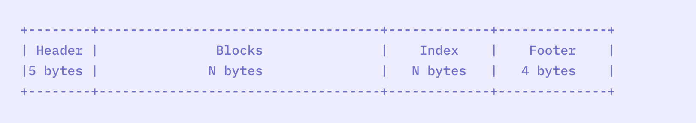

# InfluxDB
In diesem Abschnitt wird die TSDB InfluxDB vorgestellt sowie dessen Vor- und Nachteile gegenübergestellt.
InfluxDB wurde im Jahr 2013 entwickelt und ist mittlerweile einer der am weitesten verbreitete TSDB. InfluxDB ist eine NOSQL TSDB und eine Open-Source Datenbank. 
Neben der Open Source Version ist InfluxDB auch als Enterprise Version erhältlich und verfügt zudem über ein cloudbasiertes System.
InfluxDB wurde speziell für die Verarbeitung von riesige Mengen an zeitindexierte Daten, die z.B. von IoT-Geräten erzeugt werden, entwickelt.  
Die Grundidee von InfluxDB ist das Speichern von Zeitreihen sowie insbesondere die Verfolgung von Metriken und Ereignissen von Geräten und Diensten im Zeitverlauf.
InfluxDB unterstützt hohe Schreiblasten, speichert große Datenmengen und spart Platz durch Downsampling, automatisches Auslaufen und Löschen unerwünschter Daten sowie Backup und Restor. Neben der Anwendung als TSDB kann InfluxDB auch als Spatial DBMS funktionieren, dessen Funktionsweise allerdings hier nicht betrachtet wird [3.1.1]. 

## Datenmodell/-struktur

Die Strukturierung der Daten erfolgt mit Elementen wie tiemstamps, field keys, field values oder tags. 
Für die Timestamps werden als Spalte _time die Daten mit einem Zeitstempel indexiert. Die Auflösung der timestamps ist variabel und kann bis zu einer Nanosekunde reichen.

Damit eine effiziente Speicherung der unterschiedliche Zeitreihenserien erfolgt, werden die Datenelemente in zeitstrukturierten Merge-Tree- (engl. TSM) und Zeitreihenindex- (engl. TSI) Dateien hinterlegt. Eine TSM Datei besteht aus den in Abbildung 3.1.1 dargestellten vier Abschnitten [3.1.2].

 
Abbildung 3.1.1: Struktur von TSM [3.1.2]

Damit wird erreicht, dass die Anzahl der Datenbankenserien nicht durch den Speicherplatz auf der Serverhardware begrenzt ist. Das Prinzip dieser Speicherverteilung wird im weiteren Verlauf dieses Kapitels genauer erläutert. 
Zur Anzeige von Rohdaten im Daten Explorer und zur Rückgabe von Abfrageergebnisse kann zudem ein tabellarisches Datenschema in kommentierter CSV-Syntax verwendet werden [3.1.2].   

Das tabellarische Datenschema beinhaltet 
1.  Kommentarzeilen, um Eigenschaften der Spalte zu beschreiben (z.B. durch #group, #datatype, #default)
2.  Eine Kopfzeile, um die Spaltenbeschriftungen, die die Daten in jeder Spalte beschreibt, zu definieren (z.B. mit table, _value, _field, _measurement) 
3.  Datenzeile, die in der Kopfzeile angegebenen Daten für einen Punkt enthalten
4.  Zusätzlich zu den Spalten, die in jeder Datenzeile (die in der Kopfzeile angegeben sind) sind die Spalten {annotation, result, table} optional
5.   Gruppenschlüssel, um die Datensätze zu gruppieren, die in bestimmten Spalten gemeinsame Werte aufweisen, um den Inhalt von Ausgabetabellen zu bestimmen. 

Außerdem verfügt InfluxDB über zwei interne SQL-ähnelnde Abfragesprachen InfluxQL und Flux.   
Durch die eigenen Sprachen gibt es viele vorimplementierte Funktionen, die genau auf die Abfragen in der DB ausgerichtet sind.  
InfluxDB unterstützt die Datentypen Integer, Float, String und Boolean [3.1.2].

## Partionierungsmechanismen

Für die Partionierung der Daten wird die Sharding Methode verwendet. Ein Datensatz wird in mehrere Untergruppen, den sogenannten Shards aufgeteilt und jeweils von einer eigenen Serverinstanz verwaltet.  
Die Aufteilung der Daten kann z.B. nach bestimmten Indexen einer Spalte erfolgen. Bei InfluxDB erfolgt die Aufteilung nach zeitlichen Datenblöcken und wird auf der InfluxDB Speicher Engine, der TSM (engl. Time-Structured Merge Tree), der Storage Engine Datenbank von InfluxDB abgebildet.  
In den TSM-Dateien sind die kodierten und komprimierten Zeitreihendaten, die in Shards organisiert sind, enthalten.  
Jedes Shard wird zu einer bestimmte Shardsgruppe zugeordnet.  
Shardsgruppen sind Container für Shards, in denen die eigentlichen Zeitreihendaten enthalten sind. Die Zeitintervalle der Shards fallen in das Zeitintervall der Shardsgruppe.  
Pro Shardsgruppe kann es entweder nur einen einzigen Shard geben (z.B. in der Open-Source Version von InfluxDB) oder mehrere Shards pro Gruppe, was z.B. häufiger in einem Multi-Node-Cluster vorkommt.  
Jede Shardsgruppe besitzen ihren eigenen Aufbewahrungsrichtlinien, denen die Shards der Gruppe unterliegen.
Ein Bestandteil dieser Richtlinien ist z.B. die Gruppendauer der Shards. Diese gibt das Zeitfenster vor, dass jede Shardsgruppe umfasst.  
Bei der Konfiguration der Aufbewahrungsrichtlinie kann das Zeitintervall entsprechend angegeben werden. Standardmäßig beträgt dies sieben Tage.  
Das Sharding der Daten in InfluxDB ermöglicht eine Steigerung der Gesamtleistung.  
Dabei sollte auch bedacht werden, dass die Daten in TSDB immer weiter zunehmen und eine Unterteilung der Daten dafür sorgt die Effizienz der Datenbank durch das Steigende Datengehalt nicht negativ zu beeinflussen, da eine detaillierte Aufteilung der Datensätze erfolgen kann [3.1.3].   

## Replikationsmechanismen
Es gibt keine Vorschrift nach was für einem Mechanismus und wie viele Kopien der Daten erstellt werden können.   
Der Replikationsmechanismus ist demnach frei wählbar. Der Replikationsfaktor kann in den Datenbank Aufbewahrungsrichtlinien angegeben werden. Es ist allerdings zu beachten, dass es nicht Möglich ist, zwei Kopien der gleichen Daten in einer gemeinsamen Shard-Gruppe zu speichern.   
Im Idealfall befinden sich diese in separaten Shard-Gruppen und auf separaten Knoten. Dadurch ist gewährleistet, dass bei einem Ausfall eines Knotens immer noch eine Kopie auf einem anderen Knoten zur Verfügung steht [3.1.3]

## Unterstütze Programmiersprachen
InfluxDB wurde in Go implementiert. Folgende weitere Programmiersprachen werden unterstützt [3.1.1]:

- .Net
- Clojure
- Erlang
- Haskell
- Java
- JavaScript
- JavaScript (Node.js)
- Lisp
- Perl
- PHP
- Python
- R
- Ruby
- Rust
- Scala

## APIs und andere Konzept Zugriffe
Die Zeitreihendaten werden über eine HTTPS API Schnittstelle geliefert und auch neue Dateneingaben können über dieselbe Schnittstelle akzeptiert werden.   
Ein weiterer unterstützer Konzept Zugriff ist JSON over UDP [3.1.1].

## Einsatzbereiche
Bereiche, in denen Zeitreihendaten generiert werden, die sehr komplex sind und die Kapazitäten herkömmlicher Datenbanken übersteigen (z.B. auch durch das Vorliegen von halbstrukturierten Daten), wird InfluxDB angewendet.  
Grundsätzlich ist InfluxDB auf jegliche Art von zeitbasierten Messungen, Speicherung und Abfrage in Bereichen wie Betriebsüberwachung, Anwendungsmetriken, Messungen von IoT-Geräten und Echtzeitanalysen, spezialisiert [3.1.1].

//ANDERES BSP
Als Anwendungsbeispiel kann z.B. die Entwicklung eines neuen IoT-Produkts für intelligente Thermostate dienen. Die IoT-Sensoren messen in regelmäßigen Abständen die Temperatur, die in einer InfluxDB Datenbank gespeichert werden.  
Zusätzlich können Benutzer die Temperatur des intelligenten Thermostats über die Anwendung einstellen. Jedes Mal, wenn der Benutzer das Thermostat ändert, aktualisiert sich der Zustand des Thermostats in einer zusätzlichen klassischen Datenbank.  
Außerdem wird eine Historie aller Thermostat-Temperatureinstellungen zusammen mit den Temperaturmessungen aufbewahrt.  
Die Temperatureinstellungen und -messungen ermöglichen, das Benutzerverhalten zu analysieren.   
Außerdem können diese Daten dafür dienen, das intelligente Thermostat noch intelligenter zu machen, in dem Änderungen vorhergesagt werden können, bevor der Benutzer die Einstellungen überhaupt geändert hat [3.1.5].

## Vorteile, Besonderheiten und Nachteile 
Grundsätzlich verfügt InfluxDB über viele leistungsstarke Funktionen. Dabei stellt die Anpassungsfähigkeit und der flexible Einsatz einer dieser Besonderheiten dar. So z.B. die Schemafreiheit. 
Als NoSQL Datenbank wird kein bestimmtes Datenschema verfolgt und es kann sowohl als relationale Datenbank über den CSV Syntax,  als auch als nicht relationale Datenbank in Zuge der TSI und TSM eingesetzt werden. Zudem können durch die Schemafreiheit auch schwächer, strukturierte Daten ohne einheitliche Struktur abgespeichert werden. 

Primär kommt die Leistungsstärke von InfluxDB durch den Partionierungsmechanismus zustanden. Wie zuvor erwähnt wird dadurch sichergestellt, dass durch das Aufteilen große Datensätze gespeichert und verarbeitet werden können. 

Grundsätzlich ist der Vorteil des Shardings das Verwalten von Datenmengen, die normalerweise die Kapazität eines einzelnen Servers sprengen würden.  
Die Anzahl der gespeicherten TSM haben keinen Einfluss auf die Startzeit der Datenbank. 
Da die einzelnen Teile von einer eigenen Serverinstanz verwaltet werden, werden nicht nur die Daten selbst, sondern auch die dafür benötigte Rechenleistung aufgeteilt.  
Ein genereller Nachteil des Shardings ist es, dass es schwierig ist bei bereits festgelegten Untergruppen weitere Server hinzuzufügen, da dies sehr umfangreiches Umspeichern auf den Servern erfordert.  
Da die Untergruppe der Datensätze in InfluxDB vorrangig durch ihr Zeitfenster definiert werden, welches logischerweise mit der Zeit weiterwächst, sollte dies in InfluxDB keine Schwierigkeit darstellen.  
Da die Abfrage primär über bestimmte Zeitintervalle erfolgt stellt auch die Schwierigkeit der Abfrage über Joins oder andere Kriterien als das Aufteilungskriterium kein Problem dar, da durch die Abfrage die Zeitintervalle der Untergruppen direkt abgefragt werden.  
Grundsätzlich werden in NoSQL-Systemen Joins nur kaum unterstützt. Deswegen stellt das Sharding eine attraktive Methode für viele Systeme dar.
Sharding kann daher für NoSQL-Systeme ohne weitere probleme implementiert werden. Dies ist eine der Hauptgründe für den zunehmenden Einsatz von NoSQL-Systemen [3.1.4].  

Ein weiterer vorteilhafter Aspekt ist, dass die Abfragesprachen speziell für InfluxDB entwickelt wurden und dadurch auf die Abfrage von Zeitreihendaten ausgelegt sind. Die Ähnlichkeit zur gängigen SQL Abfragesprache sorgt außerdem dafür, das Abfragen leicht durchgeführt werden können.
Ein weiterer Punkt ist die hohe Skalierbarkeit. Dadurch können Datenbankcluster ohne Datenbankadministrator erstellt werden.
Auch die Datenreduktion ist ein weiterer Vorteil. Der primäre Anwendungsfall von InfluxDB besteht darin, dass die Daten in jedem beliebigen Intervall oder mit beliebiger Geschwindigkeit eingegeben werden können, unabhängig vom Datenvolumen. Die Art und Weise dieser Abfragung ist die Reduzierung der Daten auf der Grundlage der Eingabedaten
Zuletzt sollte der Einsatz als Open-Source Single Server Version und die Konzeption für die Anwendung in Docker und der Cloud angemerkt werden [3.1.6].

Nachteile //

Hier ist anzumerken, dass durch die Schemafreiheit auf die Prüfung der Daten im DBMS verzichtet wird [3.1.7].  
Auch die flexiblen Aufbewahrungsrichtlinien für Zeitreihenwerten (siehe Partionierungsmechanismus) oder die kontinuierlichen Abfragen zum Downsampling der Daten kann Hindernisse mit sich bringen.///// --warum?!

Durch die starke Spezialisierung als TSDB ist InfluxDB auf die Zeit Indexierung angewiesen. Eine gute Performance der Abfragen und Verarbeitungen kann somit nur gewährleistet werden, wenn die zeitliche Abfolge stimmt.   
Weiterhin ist zu erwähnen, dass InfluxDB zwar als Open Source Version verfügbar ist, es hier aber gewisse Einschränkungen gegenüber der Enterprise Version gibt.

Durch ihren Aufbau ist sie nur bedingt für das Speichern von anderen, nicht zeitbezogenen Werten geeignet.

